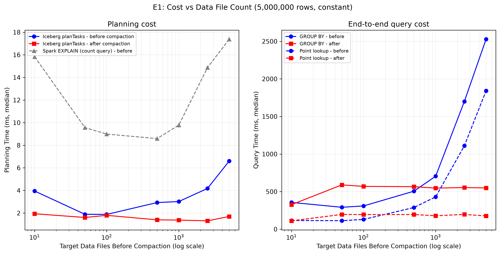
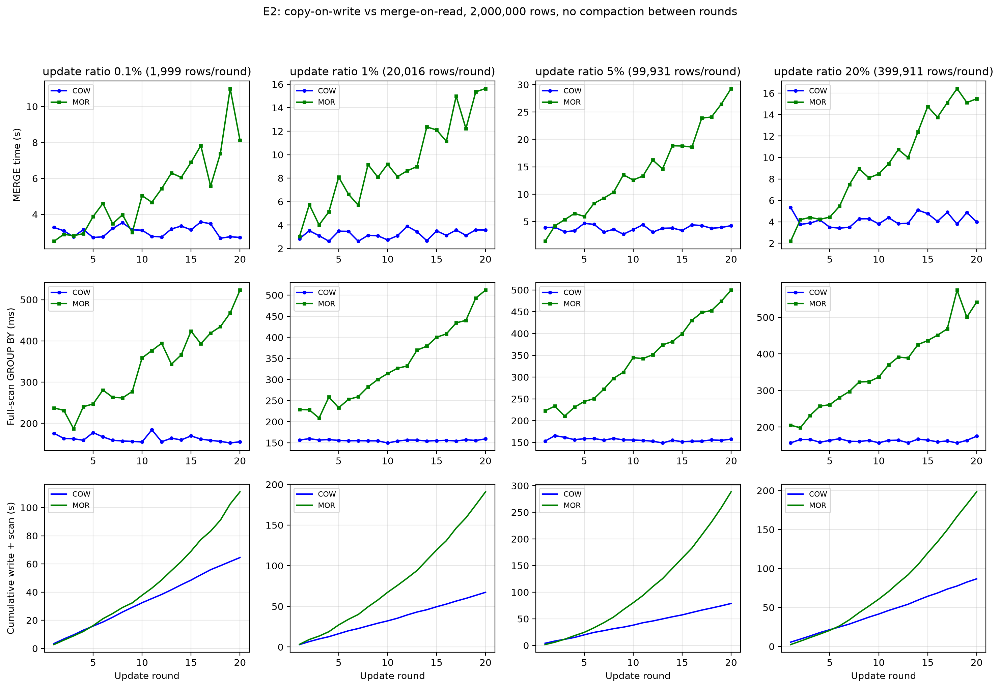
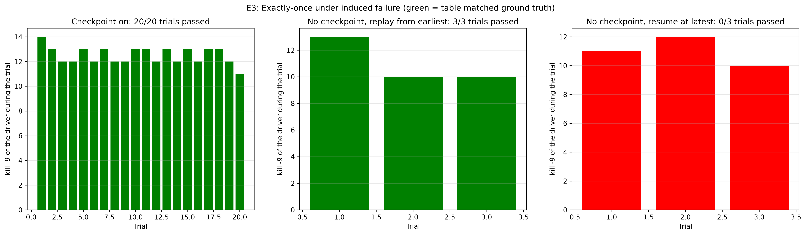

# Streaming Lakehouse: CDC from Kafka into Apache Iceberg

Every number here comes from a CSV in `results/`, produced by a script in `bench/` on
one 16 GB Apple-silicon Mac. That covers HDFS 3.3.6, Spark 3.5.0 `local[4]`,
Iceberg 1.10.0, Kafka 3.8.0 (KRaft) and Python 3.11. Anything taken from documentation
instead of measured is marked *(docs)*.

---

## 1. Problem

An e-commerce `orders` table changes constantly: `PLACED -> PAID -> SHIPPED -> DELIVERED`,
plus `CANCELLED` and `REFUNDED`. Analytics needs the current state of every order without
querying the production database.

On the classic Hadoop stack that is awkward. HDFS files are immutable, and plain Hive tables
have no row-level UPDATE or DELETE. That leaves three bad options: rewrite whole partitions
on a schedule (stale and wasteful), never apply updates (wrong), or use Hive ACID (Hive-only,
covered in section 8). An open table format like Apache Iceberg adds row-level `MERGE INTO`
over immutable files, and any engine that reads the format sees the result. This project
measures what that costs and where it breaks.

## 2. Background: why an Iceberg commit is atomic

An Iceberg table is a tree of immutable files *(docs)*:

```
metadata.json (vN)            current schema, partition spec, snapshot list, pointer to current snapshot
  -> manifest list (snap-*.avro)  one per snapshot: which manifests make up this snapshot
       -> manifest (*.avro)       a list of data/delete files + per-file partition values and column stats
            -> data file (*.parquet) / delete file (position or equality deletes)
```

A writer never edits a file in place. It writes new data files, new manifests and a new
manifest list, then writes `metadata.json` vN+1 and swaps the table's current-metadata
pointer. That swap is the commit. It is a single atomic operation: a rename on HDFS for the
HadoopCatalog used here, a compare-and-swap of a metastore property for HiveCatalog. A
reader that loaded vN keeps seeing vN, and a writer that dies before the swap leaves only
unreferenced files behind, which `remove_orphan_files` deletes later. Partial commits can't
happen by construction. E3 tests whether that still holds once a streaming engine sits on
top of it.

The same tree explains E1: the planner reads one manifest list plus every manifest it can't
prune, and emits one scan task per data file. E2 comes down to the two row-level write
modes:

- **copy-on-write (COW):** rewrite every data file that contains a changed row
- **merge-on-read (MOR):** write small delete files that readers must apply at scan time

## 3. System

```
producer_kafka.py --> Kafka (KRaft, 3 partitions) topic orders.cdc
     |                              |
     | expected_state_e3.json       v
     |                   ingest_kafka.py: Structured Streaming, 5 s trigger,
     |                   checkpoint on HDFS, foreachBatch -> dedupe -> MERGE INTO
     v                              v
  verify.py <------- Iceberg table (HadoopCatalog, HDFS) ------> ClickHouse, Hive CLI
                                    |
                    maintain.py: rewrite_data_files, rewrite_manifests,
                                 expire_snapshots, remove_orphan_files, rollback
```

| Component | Responsibility |
|---|---|
| `src/producer_kafka.py` | Seeded CDC workload (Debezium-shaped `op`/`before`/`after`), 40 % updates, 5 % deletes. Writes the final expected state, including every deleted key, as independent ground truth. |
| `src/ingest_kafka.py` | Streams Kafka into Iceberg. Per micro-batch: parse, keep only the latest event per `order_id`, `MERGE INTO`. |
| `src/maintain.py` | Iceberg maintenance procedures, each timed and callable on its own. |
| `src/verify.py` | Diffs the table against ground truth: duplicates, missing keys, wrong values, deleted keys that came back. |
| `bench/*` | The three experiments and the figures. |

**The in-batch dedupe is required, not an optimisation.** A 5 s micro-batch routinely holds
several events for one order (created, then paid, then shipped). `MERGE INTO` rejects a
source with two rows matching one target row, because the result would depend on
processing order *(docs)*. `ingest_kafka.py` ranks events per `order_id` by `ts_ms` and
keeps rank 1 before merging. Leaving that out is the most common CDC pipeline bug: the job
works in testing and fails on the first busy batch. The same window also decides deletes:
if the latest event for a key is `d`, the MERGE deletes the row, whatever came before it
in the batch.

`amount` is `DECIMAL(12,2)` end to end. It is parsed from JSON as a string, never as a
double, so no cent is lost on the way in. That matters for E3, whose verifier compares
values exactly.

The dedupe needs a total order, and `ts_ms` doesn't provide one. The producer emits a
create and an update for the same order within one millisecond, so ordering by `ts_ms`
alone kept an arbitrary event whenever two tied. Events are keyed by `order_id`, so every
event for one order lands in the same Kafka partition, and the partition offset orders
them exactly. It breaks ties: `ORDER BY ts_ms DESC, offset DESC`.

### Three engines, one table

The same `GROUP BY region` over the same Iceberg table returned identical results from all
three engines. There was no export and no copy: every engine read the table's own metadata
on HDFS (`results/phase5/three_engines.txt`):

| region | Spark 3.5 | ClickHouse 26.9 (`icebergHDFS`) | Hive 3.1.3 CLI |
|---|---|---|---|
| west | 765 / 1,954,193.05 | 765 / 1,954,193.05 | 765 / 1,954,193.05 |
| south | 770 / 1,934,091.09 | 770 / 1,934,091.09 | 770 / 1,934,091.09 |
| east | 744 / 1,798,098.87 | 744 / 1,798,098.87 | 744 / 1,798,098.87 |
| north | 715 / 1,752,902.84 | 715 / 1,752,902.84 | 715 / 1,752,902.84 |

The row total, 2,994, equals the verifier's count for that table's last trial. That shows
ClickHouse and Hive read the current snapshot only, not every Parquet file on disk. Getting
the two non-Spark engines there took five interoperability fixes, each recorded in the
scripts:

- **ClickHouse.** The NameNode advertises the DataNode as `127.0.0.1`, which inside a
  container is the container itself. The fix was to connect by the DataNode's hostname,
  mapped to the host.
- **Hive, runtime version.** Hive 3 support ends at `iceberg-hive-runtime` 1.7.2, and the
  last Java 8 build is 1.6.1.
- **Hive, jar loading.** The jar has to be on `HIVE_AUX_JARS_PATH`, because `ADD JAR` comes
  too late for the MapReduce task.
- **Hive, vectorised reader.** The 1.6.1 vectorised reader throws a NullPointerException on
  Hive 3.1.3, so vectorisation is disabled for the query.
- **Hive, compression.** Iceberg 1.10 writes zstd, and Hive's reader decodes it through
  Hadoop's native `ZStandardCodec`, which macOS doesn't have. The table was switched to
  gzip and rewritten. This is the most practical lesson here: an open format does not
  guarantee every reader supports every codec.

## 4. Experiment 1: planning cost vs data-file count

**Question.** How do planning cost and query cost grow with data-file count at constant data
size, and what does compaction buy back?

**Method** (`bench/e1_planning.py`, `results/e1/planning_vs_files.csv`)

- 5,000,000 rows in every table. The only thing that changes is how many files hold them:
  targets 10, 50, 100, 500, 1000, 2500, 5000.
- The file count is forced exactly. Each write task owns one partition value, AQE
  coalescing is off, and `write.distribution-mode=none`. Actual counts reached 86-90 % of
  the target (e.g. 4389 for 5000). The shortfall is hash collisions in `repartition`:
  some tasks received two buckets of the same region and wrote them as one file. The
  analysis uses actual counts.
- At each point the harness measures, compacts (`rewrite_data_files` + `rewrite_manifests`)
  and measures again, so both curves come from the same data.
- Each metric is the median of 5 timed repetitions after one discarded warm-up.
- **Planning** is timed as Iceberg's own `newScan().planTasks()`, drained on the JVM. Spark
  `EXPLAIN` is recorded alongside it for contrast (see Limitations).
- **Query cost** uses three fixed queries: a full-scan `GROUP BY region`, a
  single-partition `count(*)`, and a point lookup on `order_id`.

**Results**

| target | files | scan tasks | Iceberg plan ms | GROUP BY ms | point lookup ms | metadata KB |
|---:|---:|---:|---:|---:|---:|---:|
| 10 | 9 | 1 | 3.95 | 356 | 116 | 17 |
| 50 | 44 | 2 | 1.89 | 292 | 113 | 18 |
| 100 | 86 | 3 | 1.88 | 309 | 130 | 19 |
| 500 | 443 | 14 | 2.93 | 506 | 288 | 33 |
| 1000 | 878 | 28 | 3.02 | 705 | 430 | 44 |
| 2500 | 2213 | 70 | 4.18 | 1700 | 1110 | 95 |
| 5000 | 4389 | 138 | 6.60 | 2528 | 1841 | 151 |
| *any, compacted* | 4 | 1 | 1.3-1.9 | 546-590 | 177-196 | 61-327 |



**Findings**

1. **Planning is not where small files hurt at this scale.** Iceberg planning grew from
   1.9 ms to 6.6 ms over a 100x increase in files (44 to 4389). That is roughly linear in
   file count once past ~500 files, and it stays in single-digit milliseconds. There is no
   superlinear knee, which the SPEC hypothesis predicted. The reason is structural: every
   table here is one commit, so all file entries sit in one or two manifests. The planner
   reads one manifest list and a couple of Avro files whatever the file count, and the
   per-file cost is only building a `FileScanTask` from an entry already in memory.
2. **Execution cost is where they hurt.** GROUP BY slowed 8.7x (292 to 2528 ms) and the
   point lookup 16x (113 to 1841 ms). Both curves are flat up to ~100 files and bend upward
   between 500 and 1000 files. At that point each file holds ~5-10k rows (~50 KB), and the
   fixed cost per file dominates the useful work. That cost covers the HDFS open, the
   Parquet footer read and a task, since 4389 files became 138 tasks against 4 cores. **The
   inflection point is between 500 and 1000 files for 5 M rows, i.e. below ~10k rows per
   file.**
3. **Compaction fixes it, and can overshoot.** After compaction every table had 4 files
   (one per region) and the point lookup returned to ~180 ms from as high as 1841 ms. But
   4 files plan as **1 scan task**, so the GROUP BY ran on one core and took ~550 ms. That
   is almost twice the 292 ms of the 44-file layout, which gave 2 tasks. Compacting to
   fewer files than the cluster has cores is a measurable regression, and it's the negative
   result for E1.
4. **Metadata grows after compaction** (17 KB to 327 KB at the 5000 target). Compaction
   adds a snapshot; it doesn't remove the old one. The old manifests stay until
   `expire_snapshots` runs, so compaction has to be followed by expiry to reclaim metadata.
5. **The filtered `count(*)` stayed at 13-22 ms at every file count.** Iceberg answers it
   from manifest column statistics without opening a data file (aggregate pushdown). That
   is also why timing Spark's `EXPLAIN` of that query, as the first version of this
   harness did, can't show planning cost.

## 5. Experiment 2: copy-on-write vs merge-on-read

**Question.** Iceberg documents that COW pays on write and MOR pays on read *(docs)*. Where
do those costs cross over on this setup, and after how many update rounds?

**Method** (`bench/e2_cow_mor.py`, `results/e2/`)

- Two tables differ only in `write.{update,delete,merge}.mode`. Each starts with the same
  2,000,000 rows (format v2, partitioned by `region`), about 25-30 MB of Parquet.
- Each sweep runs 20 rounds of `MERGE INTO`. Each round updates p % of the rows, chosen
  deterministically by `crc32(order_id, round)`, so both tables receive identical batches.
  The sweeps use p = 0.1, 1, 5 and 20 %.
- No compaction runs between rounds.
- Per round and table, the harness records: MERGE wall time, bytes committed (from the
  snapshot summary), delete-file count, a full-scan `GROUP BY` and a point lookup. The two
  queries are medians of 3 after one warm-up.
- A first pilot used near-constant row values. It compressed 100k rows to 62 KB, which made
  a COW rewrite free (section 7), and was discarded.

**Results**

| p | rows / round | round-1 MERGE, COW vs MOR | round-20 MERGE, COW vs MOR | bytes written over 20 rounds, COW vs MOR | round-20 scan, COW vs MOR | total-cost crossover |
|---:|---:|---:|---:|---:|---:|---:|
| 0.1 % | 2,000 | 3.3 s vs **2.5 s** | 2.7 s vs 8.1 s | 606 MB vs **2 MB** | 155 vs 523 ms | round 5 |
| 1 % | 20,000 | **2.8 s** vs 3.0 s | 3.6 s vs 15.6 s | 606 MB vs **13 MB** | 159 vs 512 ms | round 1 |
| 5 % | 100,000 | 3.9 s vs **1.4 s** | 4.3 s vs 29.3 s | 574 MB vs **60 MB** | 157 vs 499 ms | round 3 |
| 20 % | 400,000 | 5.3 s vs **2.2 s** | 4.0 s vs 15.5 s | 567 MB vs **223 MB** | 175 vs 542 ms | round 6 |

*Total-cost crossover:* the first round at which MOR's cumulative write + scan time exceeds
COW's (`results/e2/crossover_summary.csv`).



**Findings**

1. **MOR's write advantage exists, but only right after a compaction.** In round 1 MOR
   merged 2.4-2.8x faster at 5-20 % and wrote 4x-600x fewer bytes. That fits the mechanism:
   COW rewrote every data file (~29 MB) every round, because a uniformly spread update
   touches every file. MOR wrote only the changed rows plus small position-delete files.
2. **The advantage disappears within a few rounds, and the reason isn't documented.** MOR's
   MERGE time grew almost linearly with its delete-file count, reaching 3-7x COW by round
   20. A MERGE is a join against the target, so it reads the target through the MOR read
   path: every data file plus every accumulated delete file for its partition. Each round
   adds 4 delete files (one per partition) and 4 data files, so each MERGE reads more than
   the one before. The cheap write path pays the read-side cost too.
3. **MOR reads are slower from the first delete file on.** The full scan was 31-46 % slower
   after round 1 and 3.1-3.4x slower at round 20, at every ratio. Point lookups were 45-65 %
   slower throughout.
4. **Bytes written is the one dimension MOR keeps winning.** After 20 rounds at 0.1 %, COW
   had written 606 MB to change 40,000 rows and MOR 2 MB. Where write I/O or storage
   churn is the constraint, MOR still pays. That covers object-store PUT costs, snapshot
   retention and replication.
5. **The practical rule these numbers support:** on this setup, merge-on-read wins only if
   the table is compacted (`rewrite_data_files` plus `rewrite_position_delete_files`)
   roughly every 1-6 update commits, the total-cost crossover range above. Without that
   maintenance, copy-on-write is cheaper in total at every update ratio tested, from 0.1 %
   to 20 %. The SPEC expected MOR to win for a while at low update ratios before
   crossing over. It won for at most one to five rounds.

**Negative result.** The SPEC hypothesis was a crossover that depends on the update ratio,
with MOR ahead for a while at low ratios. The data doesn't show that ordering. The
crossover came earliest at 1 % (round 1) and latest at 20 % (round 6). At 1 % the batch is
large enough to touch every file (the COW cost is fixed) but too small for MOR's round-1
saving to show up above noise.

## 6. Experiment 3: exactly-once under induced failure

**Question.** If the streaming driver is `kill -9`ed in the middle of a MERGE, does the table
still end up with every change applied exactly once?

**Method** (`bench/e3_chaos.sh`, `src/verify.py`, `results/e3/`)

1. **Clean slate.** Each trial recreates the Kafka topic (3 partitions), drops the table
   and deletes the checkpoint.
2. **Workload.** The producer streams a seeded workload of 10,000 events at 100 events/s:
   creates, plus 40 % updates and 5 % deletes. It writes the expected final state,
   including every deleted key.
3. **Kills.** `ingest_kafka.py` runs with a 5 s trigger. After each incarnation commits
   its first batch, the harness sends `kill -9` at a random 0-4 s later, inside the next
   batch, then restarts the job from the same checkpoint. This repeats until the producer
   finishes.
4. **Drain.** A final `availableNow` run consumes whatever is left.
5. **Verification.** `verify.py` diffs the table against ground truth and checks four
   things: duplicates, missing keys, values that differ (status, amount, updated_at), and
   deleted keys that are present again.
6. **Control arms.** Two variants run without a checkpoint (a throwaway checkpoint per
   restart), 3 trials each, so the only difference is where a restarted job resumes.

**Results**

| Arm | Trials passed | Kills | Duplicates | Missing | Wrong value | Deleted keys back |
|---|---:|---:|---:|---:|---:|---:|
| **Checkpoint on** | **20 / 20** | 250 (11-14 per trial) | 0 | 0 | 0 | 0 |
| No checkpoint, replay from `earliest` | 3 / 3 | 33 | 0 | 0 | 0 | 0 |
| No checkpoint, resume at `latest` (Spark's Kafka default) | **0 / 3** | 33 | 0 | 2,847-3,473 | 453-672 | 127-181 |

In the checkpointed arm each trial checked 5,525-5,696 surviving orders, and the final
drain took 2-9 s.



**Mechanism.** The results separate two properties that are usually credited together to
"exactly-once":

- **The checkpoint prevents loss.** Without it, a restarted job resumes wherever
  `startingOffsets` points. At `latest`, every event produced while the driver was down
  was skipped. That lost 50-62 % of the orders and left 453-672 rows on a stale earlier
  value. It also brought back 127-181 deleted orders: a later `d` was skipped while an
  earlier `c` had already landed.
- **The idempotent MERGE prevents duplicates.** No arm produced a single duplicate. Not
  even the arm that replayed the entire topic after every kill, which passed all checks,
  because applying the same keyed, latest-wins upsert twice leaves the same table. The
  checkpoint does not provide exactly-once by itself. Spark records a batch's offsets
  before running it and marks it done only after `foreachBatch` returns *(docs)*, so a
  kill between Iceberg's commit and that marker replays the batch on restart.
- **Iceberg's atomic commit** ensures a kill during the MERGE leaves no partial result. The
  replayed batch is applied to a table that contains either all of the previous attempt or
  none of it.

At-least-once replay from the checkpoint, plus an idempotent, atomic sink, gives
exactly-once results. Swap the MERGE for an append and the replay arm would duplicate. Drop
the checkpoint and the `latest` arm shows the loss.

**Two bugs this experiment found in its own apparatus** (both fixed before the runs above):

- **Tied `ts_ms`.** The in-batch dedupe ordered by `ts_ms` alone, and ties within a
  millisecond kept an arbitrary event (section 3).
- **Time zone.** The verifier compared timestamps in the driver's local zone (IST) with
  UTC ground truth, which would have failed every row of every trial.

A third problem hid all of this: the old harness's final drain called `timeout`, which
macOS doesn't have, and its `|| true` made the drain a silent no-op. It is the reason
the earlier claim of 20 passing trials could not have been produced by that code.

## 7. Limitations and negative results

**Negative results, as measured**

- **E1:** the SPEC predicted superlinear planning growth. None was found: Iceberg planning
  stayed between 1.3 and 6.6 ms up to 4,389 files. Compacting below the core count made the full-scan
  query ~1.9x slower than a 44-file layout.
- **E2:** MOR's cheap writes lasted one round, not "a while at low update ratios." Without
  compaction, COW was cheaper in total at every ratio from 0.1 % to 20 %.
- **The first E2 pilot was discarded.** Its near-constant row values compressed 100,000
  rows to 62 KB, so COW rewrote the whole table for free. That result would have measured
  the generator, not the table format.

**Scope and method**

- **Provenance of the `git_commit` column.** The E1 and E2 runs started before their
  harness fixes were committed, so their CSVs record the parent commit `4fb2694`. The code
  that actually ran is what commits `0e17674` (E1) and `00ab27f` (E2) contain. The E3 runs
  record the commit they ran on.
- **E3 CSVs gained an `unexpected` column after the runs.** It counts rows whose key the
  producer never created. The verifier did not check this when the trials ran, which the
  demo rehearsal exposed. It is exactly derivable from the recorded columns
  (`actual_rows - (expected_rows - missing) - resurrected`, since keys are unique) and is 0
  for every trial in every arm, so no result changes.
- **One machine.** Everything ran on a 16 GB Mac: HDFS with one DataNode, Spark
  `local[4]`. Absolute times are laptop times. Only the shape of each curve, and the
  crossovers, are meant to generalise.
- **Medians only, no IQR.** The harnesses store the median of 5 (E1) or 3 (E2) timed
  repetitions after a discarded warm-up, not the interquartile range the SPEC asks for.
  The per-round E2 series show the run-to-run noise directly: COW write time moves
  between 2.6 and 5.3 s with nothing changing.
- **Warm caches.** The OS page cache was not cleared between repetitions. That was
  consistent across arms, but it favours small tables.
- **The first E1 point ran cold.** The 10-file target was measured first in a fresh JVM, so
  its planning time (3.95 ms) reads high against the 50-file point (1.89 ms).
- **E1 tables are single-commit.** All file entries sit in one or two manifests. A table
  built by thousands of streaming commits also carries thousands of manifests until
  `rewrite_manifests` runs, and its planning cost would grow faster than measured here.
  The Phase 2 table showed this: 200 commits produced 57 manifests. This is the most
  important untested case.
- **E2 table size.** At ~30 MB, a COW rewrite costs ~3 s. On a table of hundreds of GB where
  an update batch touches a small fraction of files, COW's per-round cost is far higher and
  MOR's window would be longer. The updates here were spread uniformly, so every batch
  touched every file. That is the worst case for COW, and COW still won in total.
- **E2 used Iceberg v2 position deletes.** Format v3 deletion vectors (SPEC stretch goal S2)
  change MOR's read cost and were not tested.
- **E3 workload size.** 10,000 events per trial (~5,600 surviving orders) instead of the
  SPEC's 500,000. Only the Spark driver was killed. Kafka, HDFS and the NameNode were
  never failed.
- **E3 checks final state, not every intermediate snapshot.** The verifier compares the
  final table with ground truth. It does not time-travel into each intermediate snapshot.
- **The file-source ingest (`src/ingest.py`) still orders only by `ts_ms`.** A file source
  has no offset to break ties, so it can keep the wrong event when two events for one key
  share a millisecond. The Kafka path used for E3 is fixed (section 6).
- **Maintenance conflicts with the running stream.** In the second demo rehearsal,
  `rewrite_manifests` failed with `ValidationException: Deleted manifest ... could not be
  found in the latest snapshot` because the streaming job committed while it ran. Iceberg's
  optimistic concurrency rejects a maintenance commit whose base changed. It does not merge
  it. The demo now pauses the stream for maintenance. A production pipeline would schedule
  compaction between streaming commits or retry it.
- **HadoopCatalog assumes one writer per table.** Concurrent writers need a catalog with
  compare-and-swap commits (Hive, REST, JDBC).

## 8. Comparison to Hive ACID

Hive 3 can do row-level changes. `scripts/hive/acid_compare.hql` runs the same CDC
operations against a transactional, bucketed ORC table in the course Hive environment:
Hive 3.1.3, embedded Derby, local MapReduce. Output is in
`results/phase5/hive_acid_compare.txt`.

- **Measured.** INSERT (3.9 s), UPDATE (1.4 s), DELETE (2.4 s) and a CDC-style `MERGE`
  with a delete branch (7.9 s) all ran. The final state was correct: ORD-3 DELIVERED,
  ORD-4 inserted, ORD-1 and ORD-2 gone.
- **Measured.** Those four write transactions left **8 directories** (`delta_*` and
  `delete_delta_*`) and no base. Every reader merges all of them until a compaction runs.
  `SHOW COMPACTIONS` was empty: the compactor runs inside a metastore service, and the
  embedded-Derby setup the course uses has none. This is the same read amplification E2
  measured for merge-on-read, except that Hive has no copy-on-write alternative.
- **Measured.** MERGE failed on the first attempt. Hive planned a map join whose local
  hash-table task crashed, and it only ran after `SET hive.auto.convert.join=false`.

| | Hive 3 ACID | Iceberg (this project) |
|---|---|---|
| Row-level UPDATE/DELETE/MERGE | yes | yes |
| Write strategy | merge-on-read only (delta + delete_delta) | per table: copy-on-write or merge-on-read (E2) |
| Table layout constraints | must be ORC, managed, and (in this setup) bucketed | Parquet/ORC/Avro, any partitioning, hidden partition transforms |
| Other engines can read it | Hive only *(docs)*; Spark needs the Hive Warehouse Connector | Spark, ClickHouse and Hive read the same table (section 3) |
| Time travel / rollback | no snapshots to return to | snapshot per commit; `rollback_to_snapshot` in 0.07 s (Phase 2) |
| Streaming exactly-once | no Structured Streaming sink | 20/20 chaos trials (E3) |
| Compaction | background compactor in the metastore service | explicit procedures (`rewrite_data_files`, ...) run by any Spark job |

For this use case, a mutable table that several engines read, the difference that matters
is who can read it. A Hive ACID table's row-level changes are visible only through Hive.
An Iceberg table's changes are in an open metadata tree that any engine implementing the
spec can read, as section 3 showed.

## 9. Conclusion

The pipeline streams CDC from Kafka into Iceberg on HDFS with row-level MERGE, and three
engines read the result. The three experiments produced one confirmation and two
corrections of the expectations this project started with:

- **E3 confirmed exactly-once** under 250 mid-batch `kill -9`s across 20 trials, with 0
  duplicates, 0 losses and 0 wrong values. The control arms showed which part does what:
  the checkpoint prevents loss (without it, 50-62 % of orders were lost), and the keyed
  MERGE prevents duplicates (no arm produced any).
- **E1 corrected "small files make planning slow."** At 5 M rows, Iceberg planning stayed
  under 7 ms up to 4,389 files. Execution was what slowed, by 8.7x for a full scan and 16x
  for a point lookup, starting between 500 and 1,000 files. Compacting too far (below one
  file per core) cost a further 1.9x on scans.
- **E2 corrected "merge-on-read is for update-heavy tables."** On a 2 M-row table, MOR's
  cheaper writes lasted about one commit. Its MERGE then slowed every round by reading its
  own delete files, and without compaction it lost on total cost within 1-6 rounds at every
  update ratio. Its one lasting win was bytes written: up to 290x less than COW.

The practical rules the data supports:

- Compact by rows per file, not by file count, and keep at least one file per core.
- Choose merge-on-read only together with a compaction schedule of every few commits.
- For exactly-once streaming into a lakehouse, make the sink idempotent and keep the
  checkpoint. Each one guards against a different failure.
